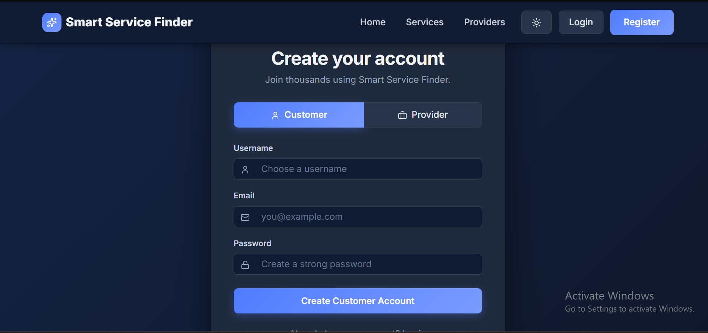
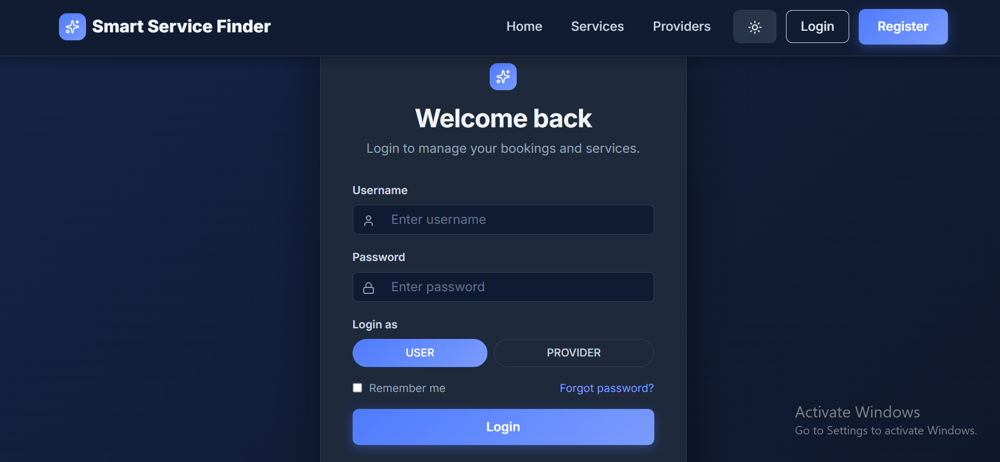
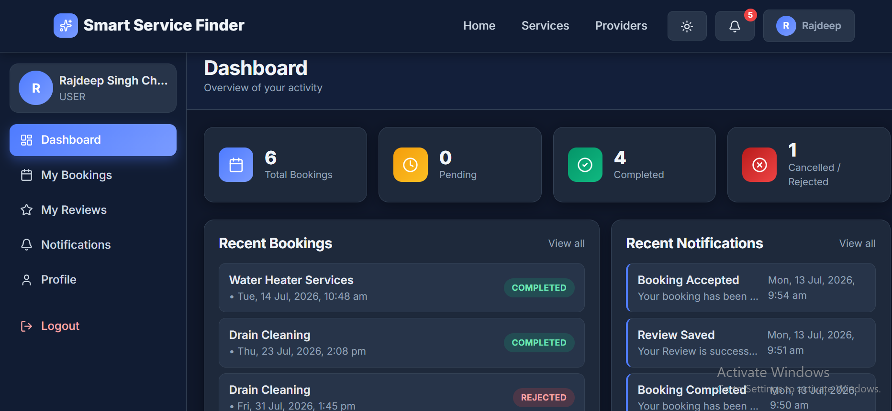
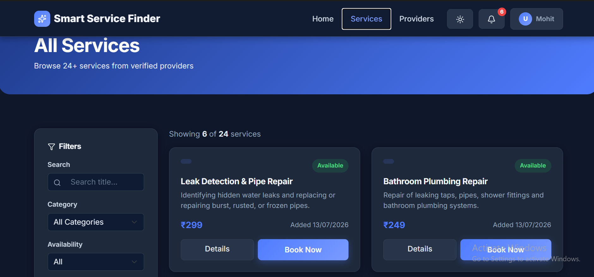
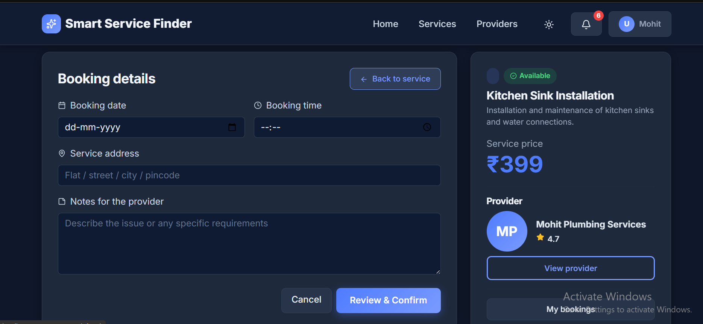
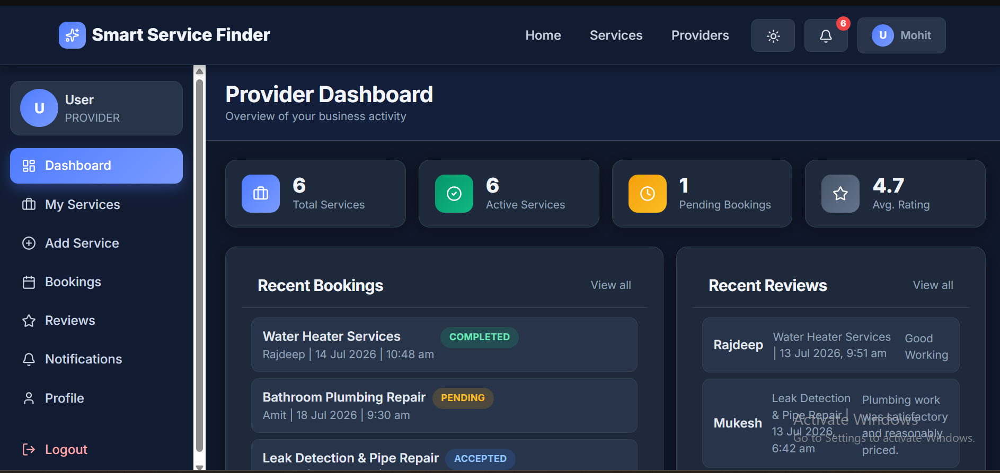

# Smart Service Finder - Frontend


## Overview

Smart Service Finder is a modern service marketplace platform that helps users discover local service providers, book services, track booking status, manage profiles, and receive notifications through an intuitive user experience.

This frontend application is built using React, TypeScript, Vite, Bootstrap, Axios, and modern component-based architecture.

---

## Live Demo

https://smart-service-finder-frontend.vercel.app/

---

## Features

### User Features

* User Registration
* Secure Login
* Service Search
* Provider Discovery
* Booking Creation
* Booking Tracking
* Review Submission
* Notification Center
* User Dashboard
* Profile Management

### Provider Features

* Provider Registration
* Service Listing Management
* Booking Management
* Provider Dashboard
* Availability Management

---

## Technology Stack

### Frontend

* React
* TypeScript
* Vite
* Bootstrap 5
* Axios
* React Router
* Context API

### Backend Integration

* Spring Boot Microservices
* API Gateway
* JWT Authentication

---

## Project Structure

```text
src

├── components
├── pages
├── services
├── context
├── hooks
├── routes
├── types
├── assets
└── utils
```

---

## Screenshots

```md













```

---

## Local Setup

Clone repository:

```bash
git clone <frontend-repository-url>

cd <frontend-project>
```

Install dependencies:

```bash
npm install
```

Run application:

```bash
npm run dev
```

Build production version:

```bash
npm run build
```

---

## Key Highlights

* Responsive UI Design
* Modern TypeScript Architecture
* Secure Authentication Flow
* Real-Time Booking Management
* Provider Discovery Experience
* Scalable Component Structure
* API Integration with Microservices Backend

---

## Future Enhancements

* Dark Mode
* Real-Time Notifications
* Advanced Search Filters
* Chat System
* Payment Gateway Integration
* Progressive Web App Support

---

## Author

Rajdeep Chouhan

LinkedIn:
https://www.linkedin.com/in/rajdeep-chouhan-5ab5a2328/

Backend Repository:
https://github.com/RajdeepSinghChouhan/Smart-Service-finder-MICROSERVICES

Live Application:
https://smart-service-finder-frontend.vercel.app/
